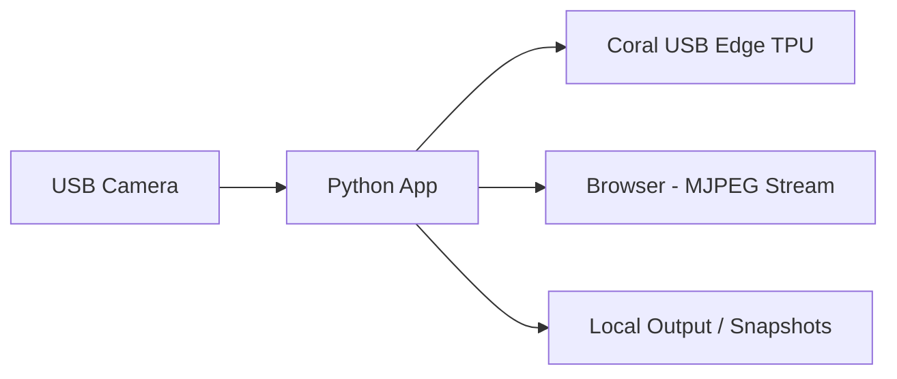

# Coral TPU Person Detection (Raspberry Pi)

This project demonstrates a robust **Person Detection** system utilizing the **Coral USB Edge TPU** on a Raspberry Pi.
It covers multiple operational modes, ranging from initial testing to a full-scale headless deployment with web-based monitoring.

> Ideal for: Security Systems, Perimeter Intrusion Detection, Smart Farm Monitoring, and Rapid Edge AI Prototyping.

---

## Features

- TFLite + EdgeTPU delegate (running the `_edgetpu.tflite` model)
- L6: Smoke test (still image)
- L7: Real-time USB camera (headless)
- L8: MJPEG stream (Flask)
- L9: Events recording + gallery + status API (Flask)

---

## Architecture (overview)

View full version `docs/architecture/ARCHITECTURE.md`



---

## Quickstart

### 1) Prepare dependencies (Raspberry Pi OS)

We recommend installing using apt (faster and more stable than pip on the Pi):

```bash
sudo apt update
sudo apt install -y python3-opencv python3-tflite-runtime python3-pil python3-flask
```

> If you want to use venv + pip (e.g., on a development machine), check `requirements.txt`

### 2) Put model in `models/`

Create a `models/` directory and place **EdgeTPU-ready** models inside it, for example:  `ssd_mobilenet_v2_coco_quant_postprocess_edgetpu.tflite`

> **Note**: This repository does not track model files by default (to keep the repository size small). See `.gitignore` for details.

### 3) Run

**L6 — still image**

```bash
python3 src/detect_people_tpu_image.py models/<model_edgetpu.tflite> docs/assets/input.jpg 0.5
```

**L7 — headless camera**

```bash
python3 src/detect_people_tpu_cam_headless.py models/<model_edgetpu.tflite> 0 0.5 640 480
```

**L8 — MJPEG stream**

```bash
python3 src/stream_people_tpu_mjpeg.py models/<model_edgetpu.tflite> 0 0.5 640 480 8080
# open: http://<pi-ip>:8080
```

**L9 — Events + gallery**

```bash
python3 src/stream_people_tpu_events.py models/<model_edgetpu.tflite> 0 0.5 640 480 8080
# open: http://<pi-ip>:8080
```

---

## Performance

Please record your actual results using the template at: `docs/performance/PERFORMANCE.md`  
(as performance depends on the Raspberry Pi model, camera, resolution, cooling system, and runtime version).

---

## Demo

Example from the attached file (located in `docs/demos/`)

### MJPEG Stream (L8)


### Events Recording (L9)


---

## Documentation

- `docs/README.md` — documentation index
- `docs/tutorial/` — step-by-step (00 → 09)
- `docs/architecture/ARCHITECTURE.md`
- `docs/performance/PERFORMANCE.md`

---

## License

This project is licensed under the MIT License.
