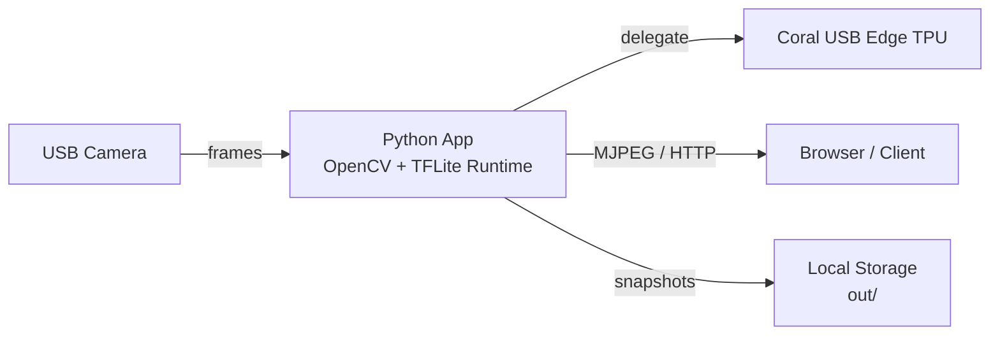
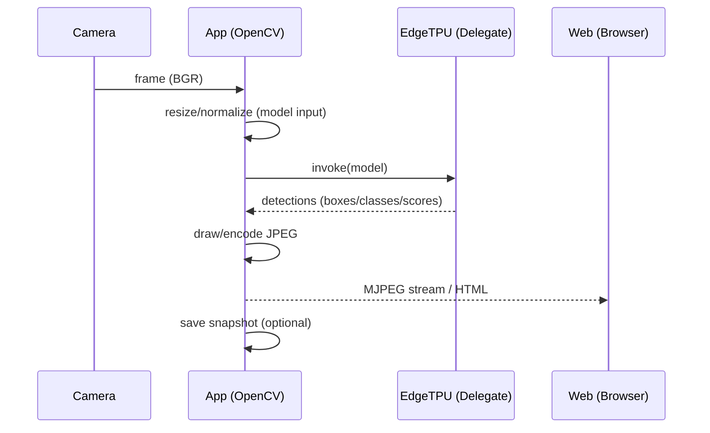

# Architecture

This projet is an example of **Person Detection (SSD/COCO) บน Raspberry Pi + Coral USB Edge TPU**  .
Focus on practical use: headless camera, MJPEG stream, and event recording via Flask.

## High-level

## Components

- **OpenCV**: Reads images from the camera + draws a frame + encodes JPEG.
- **TFLite Runtime + EdgeTPU delegate**. Runs the `_edgetpu.tflite` model on the TPU.
- **Flask**:
  - `L8` MJPEG stream (live view)
  - `L9` adds status, snapshot, and event gallery

## Runtime modes

1) **L6 Still image**  
Read images files → detect → save/output

2) **L7 Headless camera**  
Read from USB camera → detect → print counts (Suitable for performance testing.)

3) **L8 MJPEG stream**  
You can watch the live stream immediately via the website (LAN)

4) **L9 Events**  
Capture snapshots based on specified conditions (e.g., detect a person and record it) + view past records.

## Data flow (detail)

