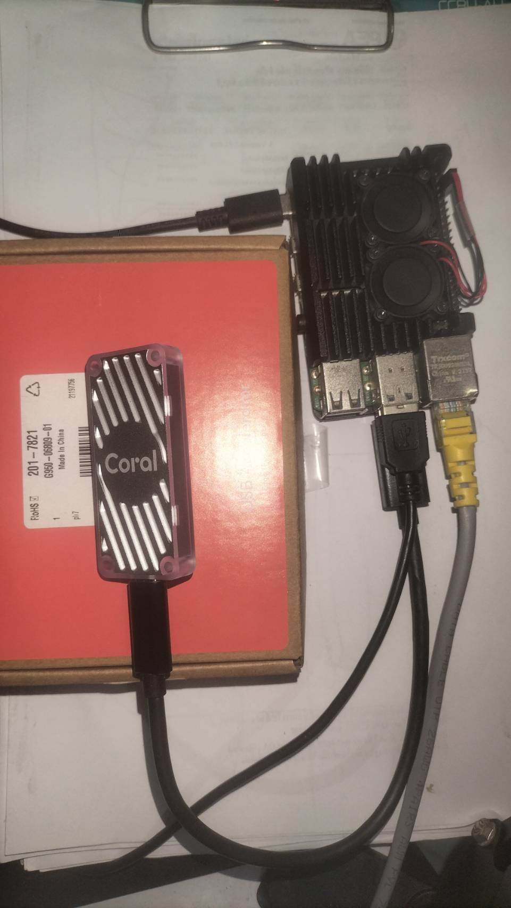

# Coral-TPU-Person-Detection Raspberry Pi 4

Realtime + Browser Stream + Events
- Person Detection on Google Coral USB TPU
- Real-time from USB Camera
- View via Browser (MJPEG Stream)
- Event Capture (Save images + faces /events + /snapshot)
- Stable operation Debian Bullseye on Raspberry Pi 4 (aarch64)

> This is suitable for starting with "general person detection" before progressing to ROI/Tripwire/MQTT in the next step.

---

## List of contents

- [L0 : Prepare-machine-flash-os-check-specs.](../tutorial/00_prepare_machine.md)
- [L1 : Update--install-basic-tools.](../tutorial/01_update_install_tools.md)
- [L2 : Install-coral-driver-libedgetpu--check-coral.](../tutorial/02_install_coral_runtime.md)
- [L3 : Installing-python-libs.](../tutorial/03_install_python_deps.md)
- [L4 : PC-windows-wsl2-compile-model-to-_edgetputflite.](../tutorial/04_compile_model_edgetpu.md)
- [L5 : Pi-side-test-model-delegate.](../tutorial/05_test_delegate.md)
- [L6 : Still image test, smoke test.](../tutorial/06_smoke_test.md)
- [L7 : Real-time-from-usb-headless-camera.](../tutorial/07_realtime_headless_camera.md)
- [L8 : Browser-mjpeg-stream.](../tutorial/08_mjpeg_stream.md)
- [L9 : Stream-events-recording-events.](../tutorial/09_events_recording.md)

---

## Notes (Problem/Decision point/Reason)

### Q1. Why not use ONNX in this pipeline?
A “straightforward and stable” Coral TPU implementation is: **TFLite INT8 → edgetpu_compiler → _edgetpu.tflite → tflite_runtime + libedgetpu**

ONNX is not necessary in this pipeline (unless you start from an ONNX model and need to transform it).

### Q2. Why won't python3-tflite-runtime install on Bookworm?
On Pi (Debian 12 / Bookworm, Python 3.11) I encountered: **python3-tflite-runtime: Depends: python3 (< 3.10) ...**

So I opted for Docker Bullseye which has python3-tflite-runtime (apt) readily available.

### Q3. Why does `pip tflite-runtime` crash/segfault?
We've encountered this: **numpy 2.x crashes modules compiled with numpy 1.x (_ARRAY_API not found) and causes a segfault.**

Stable solution: Use the apt package on Bullseye (matching version).

### Q4. Why does cv2.imshow() not work in a container?
Because the container doesn't have a GUI/GTK/X11 → error

Can't initialize GTK backend
Solution: headless or stream through a browser

### Q5. Why did /events always show 500 (KeyError: font-family)?
The common reason is using str.format() with HTML/CSS that has {} in the style, causing the formatting to be misunderstood.

The correct solution: escape {} with {{ }} or switch to .replace() for specific tokens.

### Q6. Docker build error due to core files
We've encountered this before: Error checking context: no permission to read ... /core

Solution: Delete the core files and add .dockerignore.

### Q7. Double Frame 
Some USB cams send twice the frame rate (480→960), making the image appear as two overlapping frames.

Fix this by cropping the image to half in the code (if you encounter this issue again).

---